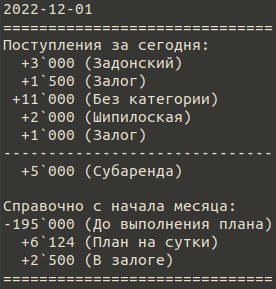

# Бизнес задача
Необходимо чтобы менеджер и руководитель получали отчёт по запросу.

Отчёт делается на основе аккаунта руководителя в [Дзенмани](https://zenmoney.ru/).

Отчёт выводится на текущий день (на день запроса).

## Менеджеру необходима следующая информация:
- развёрнутые поступления по субаренде в т.ч. залоги
- развёрнутые невыясненные поступления (без категории)
- поступления по субаренде всего за день

- справочно: Поступления с начала месяца: факт / план. _**План** - это сумма предполагаемых расходов за месяц: `Аренда(148000)` + `ЗП(35250)` + `Телефон(1950)` + `Реклама(3000)` + `Интернет(3500)` + `Доход (8300)`_.
- справочно: План на сутки. Считается так: (`План_на_месяц` - `Факт`) / `Кол_во_дней_до_конца_месяца` 
- справочно: Сумма в залоге (Залог).

## Пример отчёта

  

